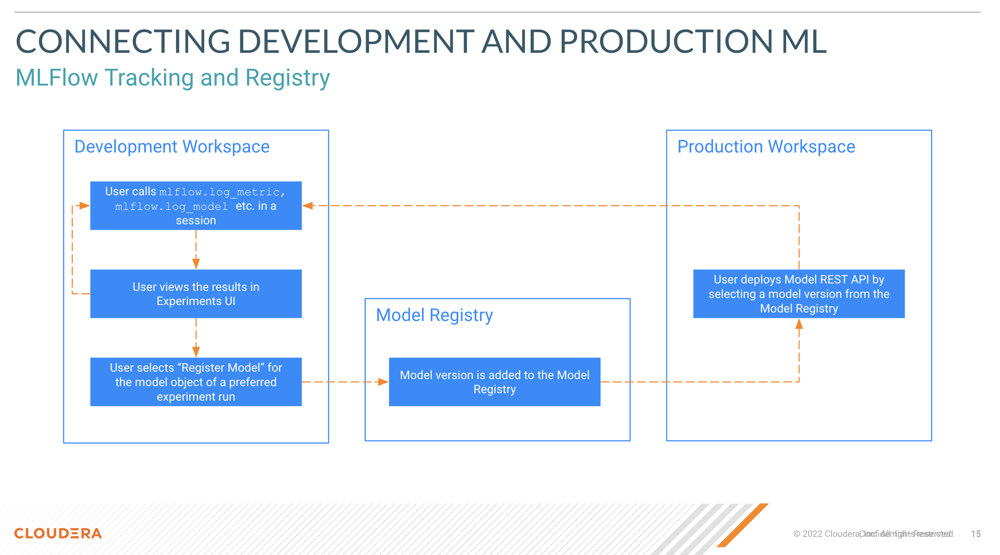

# CML BancoDev HOL 12/04/24

Cloudera Machine Learning es la plataforma de aprendizaje automático nativa en Cloud de Cloudera, construida para CDP. Cloudera Machine Learning unifica la ciencia de datos y la ingeniería de datos de autoservicio en un único servicio portátil como parte de Cloud empresariales para análisis multifuncionales de datos en cualquier lugar.

CML empodera a las organizaciones para construir e implementar capacidades de aprendizaje automático e IA para negocios a gran escala, de manera eficiente y segura, donde quieran. Está diseñado para la agilidad y potencia de la computación en la nube, pero no se limita a ningún proveedor de nube o fuente de datos en particular.


### Aprendizaje Automático en Producción

Hay varias formas diferentes de implementar un modelo. Lo que se entiende como modelo en Producción puede diferir mucho dependiendo del tipo de caso de uso que estés tratando de realizar. Podría ser tan simple como generar un report, o tan complejo como implementar un proceso de ciencia de datos repetible crítico para las operaciones comerciales. Sin embargo, independientemente del caso de uso, el éxito del aprendizaje automático en producción requiere una implementación simplificada, sin fricciones y predecible, así como una gobernanza continua de los modelos de aprendizaje automático en producción, a escala.


### Desafíos del Aprendizaje Automático en Producción

Desplegar y escalar la IA/aprendizaje automático en toda la empresa requiere implementar flujos de trabajo complejos e iterativos de principio a fin, desde la captura de datos hasta el desarrollo de modelos de aprendizaje automático para lograr los resultados esperados. Esta no es una tarea fácil. Además, a medida que el número de proyectos y modelos de IA/aprendizaje automático se multiplican, el aprendizaje automático en producción puede ser lento, engorroso y lleno de "falsos comienzos" que lo hacen aún más difícil y costoso. Si bien el lifecycle completo del aprendizaje automático siempre se ha presentado como un "ciclo" real, hasta la fecha ha habido un éxito limitado en la gestión real de este proceso de principio a fin a escala empresarial. Algunas razones para esto son:

* Los científicos de datos generalmente no son ingenieros capacitados y, por lo tanto, no siempre siguen buenas prácticas de DevOps.
* Los ingenieros de datos, los científicos de datos y los ingenieros responsables de la entrega operan en silos que crean fricciones entre los equipos.
* La gran cantidad de herramientas y marcos de aprendizaje automático fomenta la falta de estandarización en toda la industria.

El aprendizaje automático industrial de excelente calidad requiere transformación en casi todas las partes de una organización y, como resultado, los obstáculos del aprendizaje automático en producción son a menudo obstáculos a nivel de toda la organización. Algunos de estos obstáculos se describen en las siguientes secciones.

##### Monitorización insatisfactoria del modelo

La baja visibilidad sobre el rendimiento del modelo es un desafío importante. Las herramientas personalizadas para monitorear la salud técnica de los modelos no escalan. Por otro lado, las herramientas de monitoreo estándar tienden a ser demasiado genéricas para identificar el cambio en el modelo, como identificar si la ejecución del modelo de aprendizaje automático se está desviando de su objetivo.

##### Implementación ineficiente

Los científicos de datos hoy utilizan una variedad de herramientas diferentes para resolver muchos problemas comerciales críticos. Esto conduce a tiempos de ciclo más largos y posibles inconsistencias en el modelo traducido.

##### Gobernanza de aprendizaje automático inadecuada

A medida que la IA/aprendizaje automático se mueve a producción, la necesidad de gobernar todos los activos de TI (datos, modelos, infraestructura, por ejemplo) y asegurar la seguridad, privacidad y cumplimiento normativo aumenta. Definir estándares para las Operaciones de Aprendizaje Automático (MLOps) es esencial para implementar y gobernar modelos de aprendizaje automático a escala para empresas.

##### Medidas de seguridad insuficientes

Existe una necesidad de seguridad empresarial de extremo a extremo desde los datos hasta el ambiente de producción. La plataforma elegida debe ser capaz de proporcionar modelos en producción con seguridad heredada, autorización unificada y seguimiento de acceso.

##### Incapacidad de escalar

A medida que el modelo avanza hacia la producción, típicamente se expone a mayores volúmenes de datos. La plataforma debe tener la capacidad de escalar desde pequeños hasta grandes volúmenes de datos y automatizar la creación de modelos.


### Cómo CML Aborda los Desafíos del Aprendizaje Automático en Producción

CML es utilizado por grandes organizaciones para operaciones de aprendizaje automático (MLOps) seguras y gobernadas a escala. Algunos de los beneficios de CML incluyen:

* Capacidades de catalogación y linaje de modelos para permitir la visibilidad en todo el ciclo de vida de aprendizaje automático, lo que elimina los silos y puntos ciegos para una transparencia completa del ciclo de vida, explicabilidad y responsabilidad.

* Gestión completa del lifecycle de aprendizaje automático de principio a fin que incluye todo lo necesario para implementar de forma segura modelos de aprendizaje automático en producción, garantizar la precisión y escalar los casos de uso.

* Un extenso servicio de monitoreo de modelos diseñado para rastrear y supervisar tanto los aspectos técnicos como la precisión de las predicciones de manera repetible, segura y escalable.

* La capacidad de rastrear experimentos desde sesiones con MLFlow Tracking y registrar las mejores ejecuciones de experimentos en el MLFlow Registry. Cuando se utiliza en conjunto con la API de CML para MLOps, MLFlow permite las mejores prácticas de MLOps al mantener un repositorio central para todos los modelos, dependencias y otros metadatos útiles.


### MLFlow en CML

##### MLFlow Tracking

La API y la interfaz de usuario de MLFlow Tracking se utilizan para registrar parámetros, versiones de código, métricas y archivos de salida al ejecutar tu código de aprendizaje automático y para visualizar posteriormente los resultados. MLflow Tracking te permite registrar y consultar experimentos desde una Sesión o Job.

##### MLFlow Registry

Un almacén de modelos centralizado, conjunto de API y una interfaz de usuario, para gestionar colaborativamente todo el ciclo de vida de un modelo. Proporciona linaje de modelo, versionado de modelos, transiciones de etapa (por ejemplo, de pruebas a producción) y anotaciones.

##### Using MLFlow Tracking and Registry in Unison

Los científicos de datos abren una Sesión de CML y registran experimentos a través de la API de MLFlow. Esto incluye la capacidad de rastrear prototipos de modelos junto con información del usuario, conjuntos de datos y paquetes y dependencias utilizadas durante el entrenamiento.

Luego, los científicos de datos tienen la opción de registrar los mejores experimentos en el Registry de MLFlow, donde se pueden aplicar versiones y metadatos adicionales.

Un equipo de Administradores de ML designados tiene la tarea de sacar los modelos del Registry y desplegarlos en un Workspace diferente dedicado exclusivamente a casos de uso de Producción donde el acceso está estrictamente limitado. Aprovechando la API de CML, construyen y mantienen procesos de DevOps y Runtimes especiales para desplegar modelos como puntos finales de API.




### Instrucciones Para los Ejercicios

En esta segunda sesión dedicada al tema de MLOps te familiarizarás con el lifecycle de MLOps en CML.

* Desplegarás un Proyecto de CML con fines de desarrollo donde aprovecharás el Seguimiento de MLFlow para desarrollar un clasificador XGBoost para predecir transacciones fraudulentas con tarjetas de crédito y registrar parámetros de modelos.

* Una vez que hayas completado tus experimentos, registrarás la última ejecución del experimento en el Registro de MLFlow aprovechando la API de CML.

* En un Workspace dedicado a casos de uso de Producción, un miembro del equipo de Administradores demostrará el despliegue de un modelo en un punto final de API de CML.

* Finalmente, el mismo miembro del equipo volverá a desplegar el mismo modelo con recursos adicionales por medio de la API.

##### Despliegue de Proyecto

1. Visite [este enlace](https://github.com/pdefusco/cml_bancodev_hol_200324) para descargar todos los archivos.
2. Agrega un Runtimes de Python 3.9 con el editor de Workbench.
3. Cree el proyecto. Ingresa al proyecto y familiarízate con los archivos que se han subido.

##### Despliegue de Sesión y Instalación de Paquetes en Runtime

Abre una sesión con las siguientes opciones de Runtime.

```
Editor: Workbench
Kernel: Python 3.9
Edition: Standard
Version: 2023 o 2024
Enable Spark: Spark 3.2
Resource Profile: 2 CPU / 4 GB Mem / 0 GPU
```

Abre el terminal y instale los paquetes ejecutando el siguiente comando. Espera que la instalación de los paquetes termine antes que proseguir.

```
pip3 install -r requirements.txt
```


##### Creación de Tabla de Iceberg con Datos de Transacciones de Tarjeta de Crédito

Abre el script "00_datagen.py" y lo ejecute. No se requieren cambios de código. Note que el código comenzara a ejecutar a la derecha de la pantalla.


##### Entrenamiento de Modelo XGBoost

Abre el script "01_train_xgboost.py" y lo ejecute enteramente sin cambios de código.

Sal de la sesión sin terminarla y entre en la pagina de Experiments. Mire su experimento. Abrelo y familiarízate con la interfaz de MLFlow Tracking.


Luego, regresa en la sesión y cambia el valor de la variable test_size en la línea 68 de 0.3 a 0.2 y vuelve a ejecutar todo el script.


Vuelve a la interfaz de MLFlow Tracking y observa la nueva ejecución del experimento ("Experiment Run").


Reemplaza la línea 74 con la siguiente línea de código para establecer el hiperparámetro del modelo "max_depth":

```
model = XGBClassifier(use_label_encoder=False, max_depth=4, eval_metric="logloss")
```

En la línea 96, agrega esta línea de código para monitorear el nuevo hiperparámetro del modelo en MLFlow Tracking:

```
mlflow.log_param("max_depth", 4)
```

Vuelve a ejectar el script y note la nueva Experiment Run en la pagina de Experiments:


Cambia la línea 74 y la línea 96 con lo siguiente, y agrega la línea 97:

```
# línea 74
model = XGBClassifier(use_label_encoder=False, max_depth=2, max_leaf_nodes=5, eval_metric="logloss")
```

```
# línea 96
mlflow.log_param("max_depth", 2)
```

```
# line 97
mlflow.log_param("max_leaf_nodes", 5)
```

Vuelve a ejecutar todo el script. Luego, navega de regreso a MLFlow Tracking para observar la nuevo ejecución del experimento.


##### Despliegue de Experimento en el Registry de MLFlow

En la misma sesión, ejecuta el script "02_cml_api_endpoint.py". Sal del proyecto y abre la página del Registro de MLFlow. Valida que tu modelo haya sido registrado.


### Fase de Producción

El Despliegue de un Modelo desde el Registry a un API Endpoint y el redespliegue con Recursos Adicionales serán demostrados por un miembro del equipo de admin.

### Resumen

En esta segunda sesión, utilizaste Sesiones de CML, MLFlow y la API de CML para desplegar un modelo de aprendizaje automático y procesos básicos de MLOps. En conclusion:

* En grandes organizaciones, generalmente se despliegan múltiples Workspaces para separar los ambientes de desarrollo y producción.

* Los Workspaces comparten el Registry de MLFlow, que actúa como un repositorio central para modelos y metadatos, y como un mecanismo para compartir modelos de un Workspace a otro. Los desarrolladores están bloqueados para crear puntos finales de API de modelos y solo pueden registrar modelos en MLFlow Tracking y Registry. Los administradores son los encargados de desplegar modelos como Endpoints.

* La API de CML permite a los desarrolladores aumentar la productividad al permitirles tanto acceder a los Experimentos de Modelos como Registrar Modelos con MLFlow de manera programática.
